# Clash for Windows使用教程

## 安装软件

::: tip

软件下载：https://github.com/Fndroid/clash_for_windows_pkg/releases

根据电脑CPU和操作系统下载对应的版本即可。

如果找不到对应的版本，点击 `Show all 15 assets`显示全部版本。

以下操作以`CPU：x86_64，系统：Windows`为例

:::

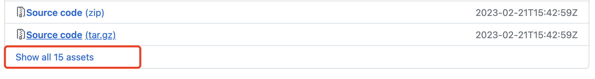

点击之后，如下图所示。显示全部版本。

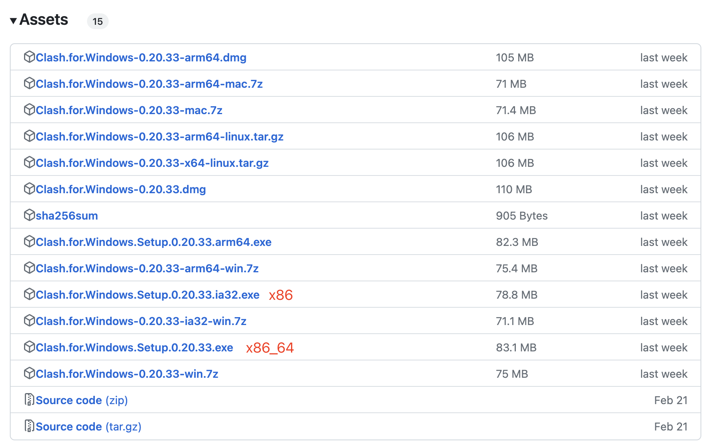

双击安装包开始安装，默认安装即可。

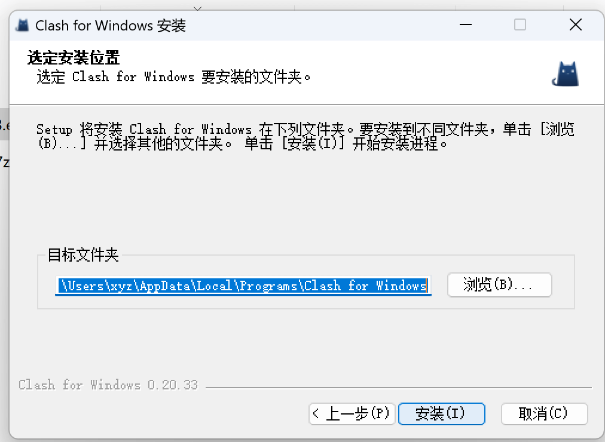

安装完成之后，如下图所示，默认是英文。

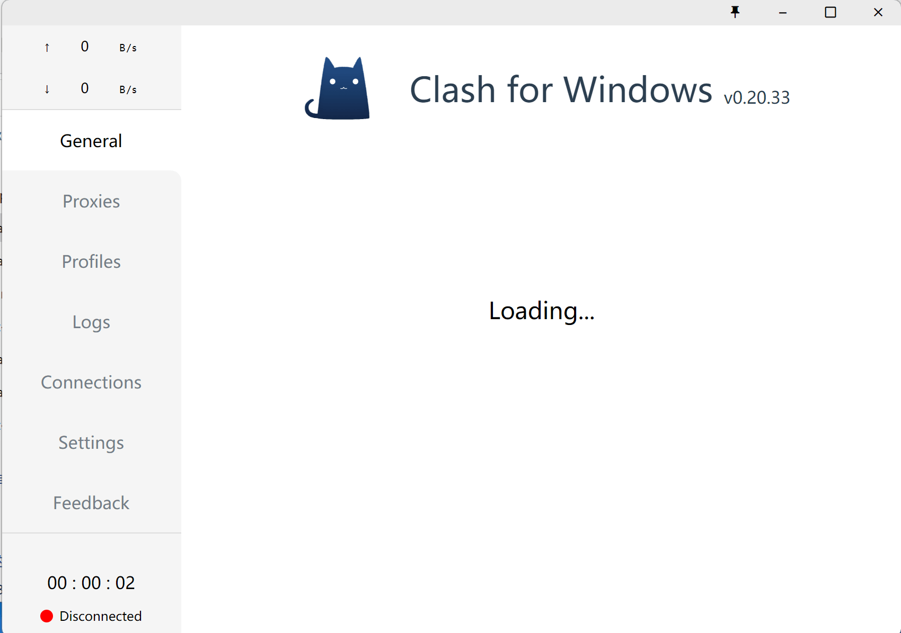

右击图标，退出软件。如下图所示。

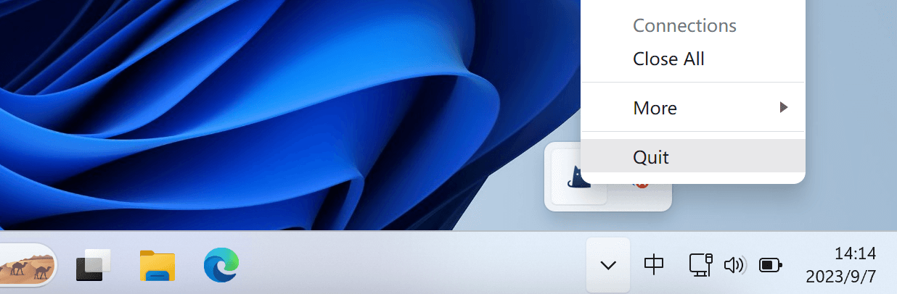

## 汉化软件
::: tip
汉化补丁下载：https://github.com/BoyceLig/Clash_Chinese_Patch/releases

:::

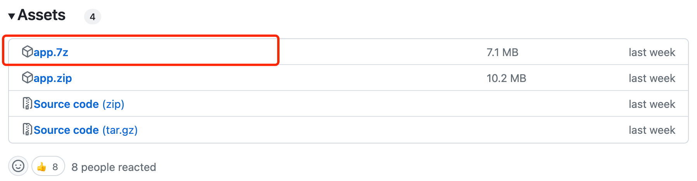

解压app.7z压缩包，得到app.asar文件。

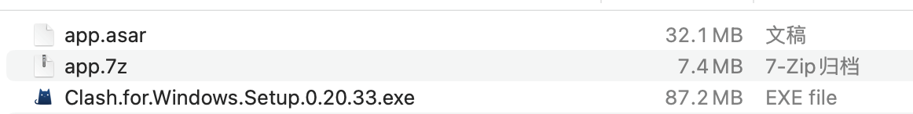

在桌面找到`Clash for Windows`软件图标，右击图标，点击`打开文件所在的位置`，再进入`resources`文件夹。

把刚刚解压的`app.asar`文件替换掉当前目录下`app.asar`文件。

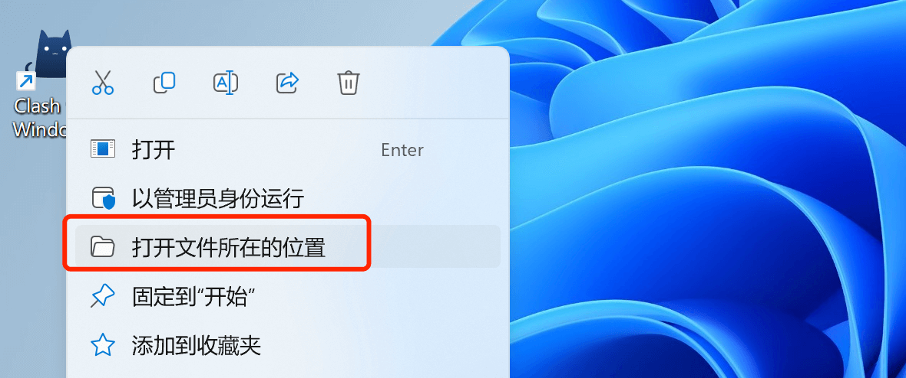

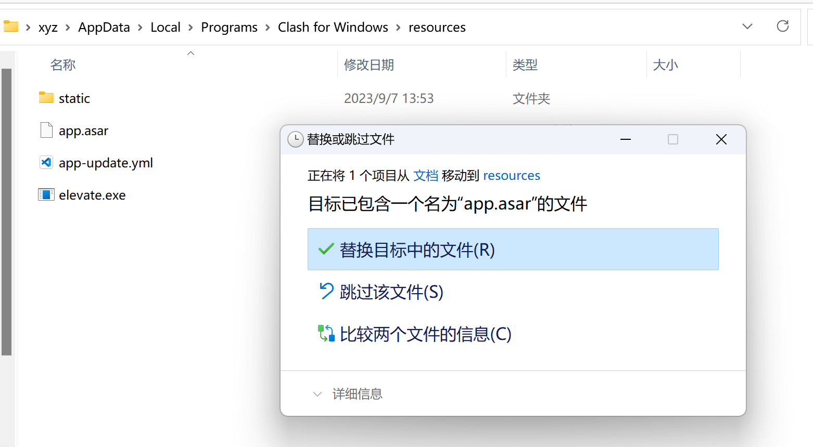

替换完成后，回到桌面双击打开`Clash for Windows`软件图标。如下图所示，软件已经完成汉化。

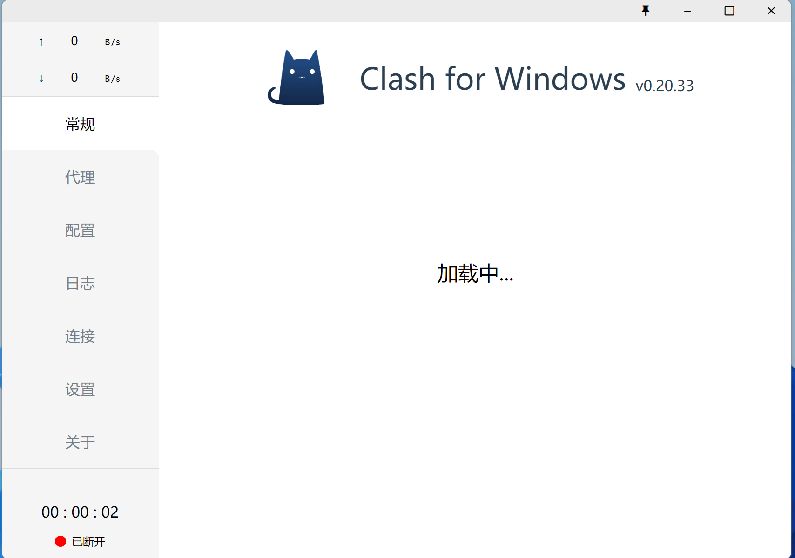

## 配置文件（订阅）

点击配置，输入订阅URL，然后点击下载。

::: tip
免费URL推荐：https://github.com/WilliamStar007/ClashX-V2Ray-TopFreeProxy

:::

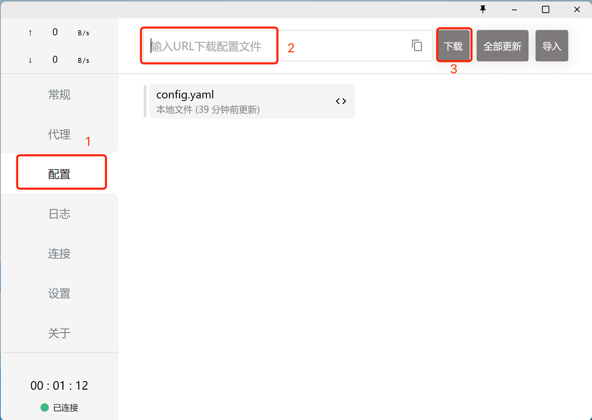

配置文件下载成功后，如下图所示。

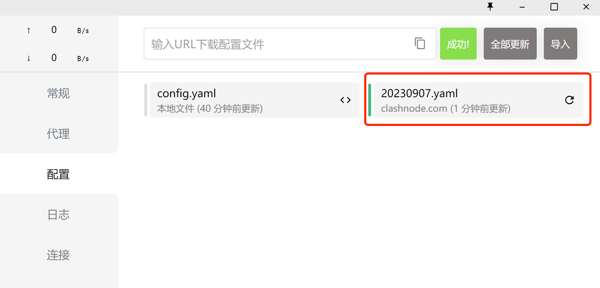

## 配置代理

::: tip
配置文件（订阅URL）不同，在该界面展示的代理方式也不相同，根据情况选择使用即可。

:::
点击代理，在代理界面可以看到，刚刚下载的配置文件节点内容，该配置文件是通过规则进行代理。

1、点击`规则`，再次点击`节点选择`后展开节点列表，再点击延迟检测，查看各节点的延迟时间。

2、选择延迟时间短的节点即可，这里选择`_US_美国`节点。

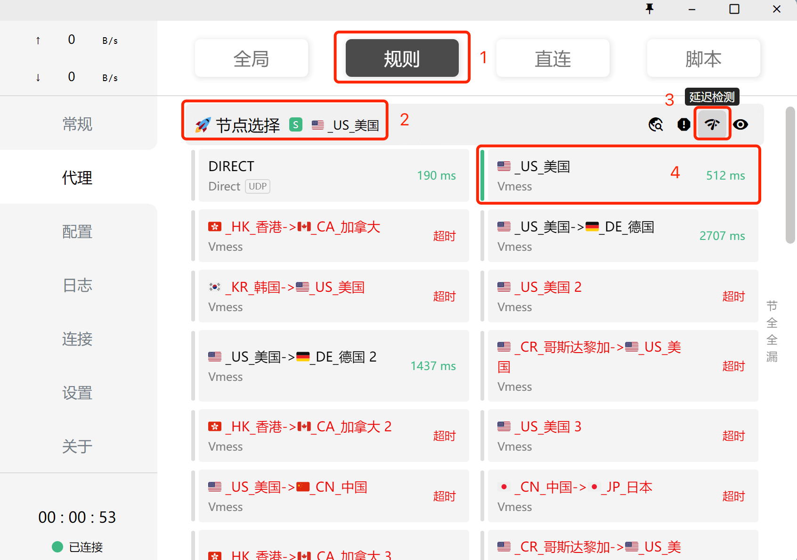

## 启动代理

点击常规，在常规界面，开启`系统代理`。如下图所示

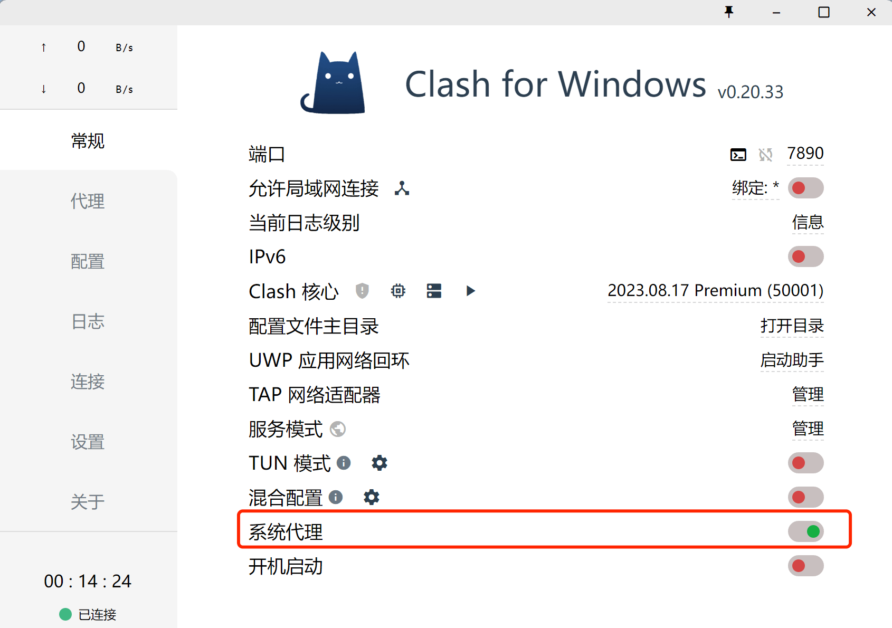

## 验证代理

进入到浏览器，输入`google.com`，出现下图所示，代表成功。

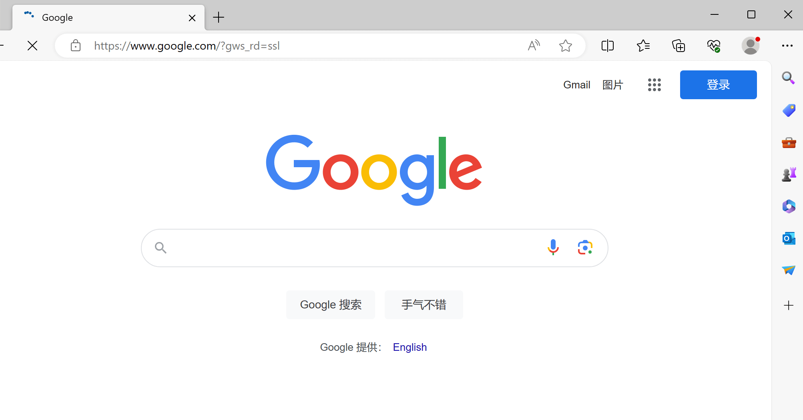

## ADC 资源群

::: tip
扫码添加微信，备注 `ADC` 即可。

:::

